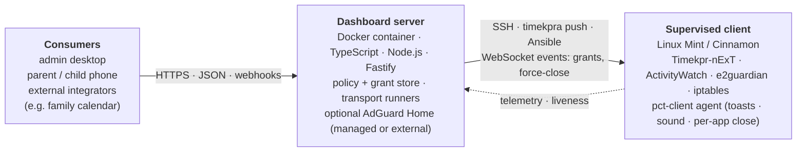

# linux-parental-controls-toolkit

A server/client toolkit for administering screen-time, per-application, and
per-website limits across Linux desktops. The server provides a web dashboard
through which an admin defines policy for supervised users; one or more Linux
clients (initial target: **Linux Mint with Cinnamon**) enforce the policy
locally using established open-source tools (Timekpr-nExT, ActivityWatch,
e2guardian, AdGuard Home).

> **Status:** Early implementation (Phase 1). The architecture and licensing
> analyses are complete and the dashboard skeleton is taking shape — a Fastify
> app, settings loader, Docker image, and CI. Most features in
> [`docs/roadmap.md`](docs/roadmap.md) are not built yet. See the roadmap for
> the work breakdown and the
> [roadmap project](https://github.com/users/BenSeymourODB/projects/2) for
> issue-level tracking.

## Quick start (local development)

Run the dashboard from source with Docker Compose:

```bash
# (optional) override defaults — the dashboard runs without this file
cp .env.example .env

# build the image from ./server and start the dashboard
docker compose up --build
```

The dashboard is then on <http://localhost:8000> (`GET /` serves a
"hello, no policy yet" placeholder; `GET /healthz` is the liveness probe).
Persistent state lives in a gitignored `./data` directory mounted at `/data`
in the container (see [`docs/server-deployment.md`](docs/server-deployment.md)
→ "Volume layout"). Configuration is read from `.env`; every setting and its
default is documented in [`.env.example`](.env.example).

This compose file builds from source for local development and deliberately
omits DNS filtering (AdGuard Home is a Phase 7 concern). For production
deployment on TrueNAS SCALE — using the published image and the AdGuard
topologies — see the reference compose files in
[`docs/server-deployment.md`](docs/server-deployment.md).

## What the product does

For each supervised Linux user account, an admin can set:

- **Overall screen-time budgets** (daily / weekly / monthly), enforced via
  Timekpr-nExT at the session level.
- **Per-activity time quotas**, where "activity" means a desktop application,
  a process group, a website, or a website group.
- **Schedules and exceptions** ("homework time has no Discord", "weekend mornings
  allow YouTube until 11:00").
- **Per-user web filtering** via e2guardian, with optional network-level
  blocking via AdGuard Home.

And on the supervised user's desktop:

- **Toast notifications and sound** when the server grants extra time
  or changes a limit.
- **Escalating warnings** as a budget runs down (every 15 min, then
  every 5 min, then every minute) so nothing is killed without
  warning, plus a configurable grace period after 0:00 to save work
  before the app is force-closed (per-app limits) or the session is
  locked (overall device limits). See
  [`docs/client-notifications.md`](docs/client-notifications.md).

Telemetry from each client (ActivityWatch) flows back to the dashboard so the
admin can see what was actually used, not just what was allowed.

## Long-term goals

These are not in the initial scope but they shape the architecture today
so we don't paint ourselves into a corner:

- **Mobile-first / PWA experience.** A SvelteKit-built progressive web
  app under `/app` for per-child status dashboards and for parents to
  adjust limits from a phone (home-screen install, push notifications,
  service worker). The Phase 1 scaffolding treats the JSON API as
  first-class so the PWA can land later without refactoring the
  internals. See `docs/roadmap.md` Phase 9.
- **API compatibility with
  [next-digital-wall-calendar](https://github.com/BenSeymourODB/next-digital-wall-calendar).**
  A family calendar and chore-tracking app that should be able to grant
  screen-time rewards when chores or calendar events are completed
  ("Alice cleaned her room → +30 min of overall time today",
  "Bob finished homework → +45 min of YouTube"). This is implemented via
  an authenticated `/api/integrations/*` surface with an immutable
  `Grant` ledger; the calendar app calls in, the dashboard records and
  enforces the grant. See `docs/architecture.md` ("External
  integrations") and `docs/roadmap.md` Phase 10.

## What this product is — and isn't

This toolkit is built for **a parent supervising a child or teenager on
the household's Linux desktops**. It is *not* hardened against a
technically motivated adult, and it is deliberately not going to be.

We invest in:

- Sensible defaults so a household admin can stand it up in an
  afternoon.
- The user-facing experience: clear warnings before time runs out, a
  grace period to save work, the ability for the calendar app to
  grant rewards.
- A clean license posture and a small, auditable codebase.

We **don't** invest in:

- Anti-tamper hooks, kernel modules, eBPF probes, or obfuscation of
  the client agent.
- Locking down `/etc`, `/usr`, or boot media against root access.
- Any feature whose purpose is "make it harder for the supervised
  user to defeat the system."

The reasoning is simple: by the time a supervised user has the skills
required to defeat the documented protections (escalate to sudo,
re-route iptables faster than Ansible reverts them, boot a live USB),
they have **outgrown the product**. The right response then is a
conversation between parent and child about expectations — not an
arms race in software. Anything we built to keep up with such a user
would make the tool worse for the many households that don't need it.

If that framing doesn't fit your situation, this is probably not the
right tool. See [`docs/client-install.md`](docs/client-install.md)
("Tamper resistance posture") for the specifics of what is and isn't
protected against.

## High-level architecture



Component-level detail (the four Fastify route groups, each transport
runner and its client target, the policy model, the event types) lives
in [`docs/architecture.md`](docs/architecture.md).

See [`docs/architecture.md`](docs/architecture.md) for the detailed view.

## Server: runs as a Docker container

The server is packaged as a single Docker image you can deploy on TrueNAS
SCALE (or any Docker / OCI host). Persistent data (the policy SQLite DB,
SSH keys for clients, Ansible inventory) lives in mounted volumes.

### GPL-aware bundling

The dashboard itself is original code with no GPL linkage; it only ever
talks to GPL components across process or network boundaries (see
[`docs/licensing-analysis.md`](docs/licensing-analysis.md)). To keep the
published image free of bundled GPL binaries:

- **AdGuard Home** (GPL-3.0): three deployment modes. The default is
  `disabled` (no DNS layer). Homelab admins who already run AdGuard
  Home (the common case) pick `external` and supply the URL +
  credentials of their existing instance — the dashboard never
  downloads or ships AdGuard at all. Greenfield deployments pick
  `managed`, in which the dashboard fetches AdGuard from upstream on
  first run into the data volume and supervises it. See
  [`docs/server-deployment.md`](docs/server-deployment.md).
- **Ansible** (GPL-3.0): installed into a separate, isolated Python venv
  inside the container's data volume on first run. (The image carries a
  stock PSF-licensed Python 3 interpreter solely to host this venv; no
  dashboard code is Python.)
- **Timekpr-nExT, ActivityWatch, e2guardian** (GPL-3.0 / MPL-2.0 / GPL-2.0):
  installed on the *client* by the client enrollment script via the
  distribution's own package manager; the server never ships their binaries.

This is consistent with the licensing analysis's recommendation: keep the
dashboard's process boundary clean, and avoid distributing GPL binaries as
part of the dashboard image.

## Client install

A `scripts/install-client.sh` (forthcoming) sets up a Linux Mint client:
installs Timekpr-nExT, ActivityWatch, e2guardian, the chosen browser's
ActivityWatch extension, configures the supervised user(s), drops an SSH
key for the server's Ansible user, and registers the client with the
server. See [`docs/client-install.md`](docs/client-install.md).

## Documentation map

| Document | What's in it |
|---|---|
| [`docs/proposed-tech-stack.md`](docs/proposed-tech-stack.md) | The four-layer architecture and the rationale for each tool choice. |
| [`docs/licensing-analysis.md`](docs/licensing-analysis.md) | License inventory, copyleft analysis, and the process-boundary rules we follow. |
| [`docs/architecture.md`](docs/architecture.md) | Detailed component / data-flow diagrams and the policy model. |
| [`docs/server-deployment.md`](docs/server-deployment.md) | Docker image design, TrueNAS SCALE deployment, GPL-component fetch-on-first-run pattern. |
| [`docs/client-install.md`](docs/client-install.md) | Client enrollment script design and Linux Mint specifics. |
| [`docs/client-notifications.md`](docs/client-notifications.md) | Client-side toast/sound notifications, time-remaining cadence, grace period, and end-of-budget enforcement (`pct-client` agent design). |
| [`docs/roadmap.md`](docs/roadmap.md) | Phased milestone plan; the basis for GitHub issues. |
| [`docs/commercialization.md`](docs/commercialization.md) | Forward-looking notes on what taking this from a homelab tool to a commercial product would require (platform breadth, giving back to upstream, willingness-to-pay). Not committed scope. |
| [`docs/adr/`](docs/adr/) | Architecture decision records. ADR 0001 fixes the timezone strategy (UTC internally, server-default TZ with per-user overrides). ADR 0002 fixes the client "My Time" dashboard's data model (hybrid, agent-first) and rendering shell (installed-browser app mode, with Tauri v2 as the upgrade path). |
| [`CLAUDE.md`](CLAUDE.md) | Guidance for AI coding agents working in this repo. |
| [`CONTRIBUTING.md`](CONTRIBUTING.md) | Local dev loop: setup, pre-commit hooks, the quality gate, tests, the frontend loop, and branch/PR conventions. |

## License

The dashboard and tooling in this repository are released under a
**proprietary source-available license** — see [`LICENSE`](LICENSE).
Source code is publicly available for inspection and personal non-commercial
use. Commercial use requires a separate written agreement with the copyright
holder. The copyright holder retains the right to re-license under different
terms (including an open-source license) at any time.

All GPL-licensed upstream tools (Timekpr-nExT, e2guardian, AdGuard Home,
Ansible) are used across process and network boundaries and are not
redistributed as part of this repository. See
[`docs/licensing-analysis.md`](docs/licensing-analysis.md) for the full
analysis.
