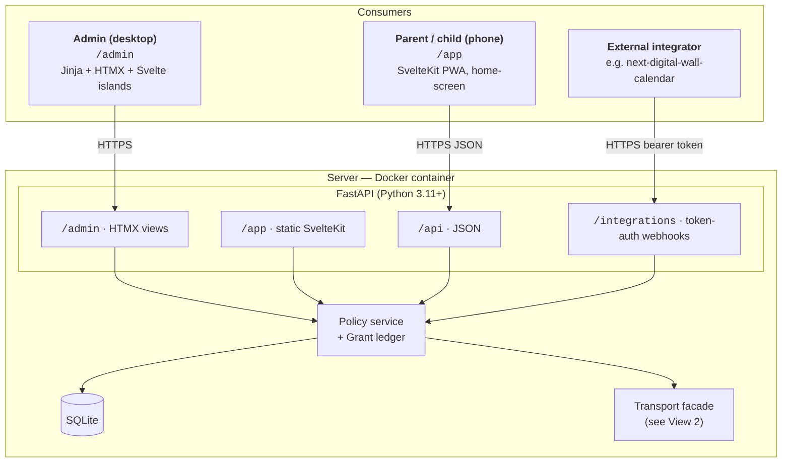
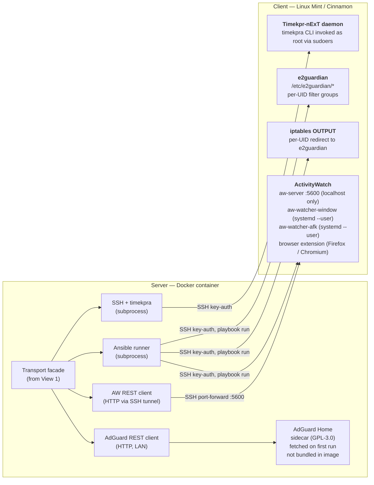

# Architecture

This document expands the layered architecture described in
[`proposed-tech-stack.md`](proposed-tech-stack.md) into the concrete component
diagram, data-flow, and policy model the implementation should follow. The
license-boundary rules in [`licensing-analysis.md`](licensing-analysis.md)
constrain how components are allowed to communicate.

## Component diagram

The architecture is shown as two stacked views. The **Transport facade**
appears in both — it is the seam between the inbound request plane
(consumers → dashboard) and the outbound control plane (dashboard →
clients).

### View 1 — Inbound request plane

How the three consumer surfaces flow into the dashboard and reach the
policy store.



### View 2 — Outbound control plane

How the dashboard reaches each managed client (and the optional
AdGuard Home sidecar). This view reads left-to-right: the dashboard's
transport facade is on the left, the client components it drives are
on the right.



## Process boundaries (license-critical)

Every line that crosses the dashed boundary between dashboard code and an
external tool is one of:

- **subprocess** — `subprocess.run` / `asyncio.create_subprocess_exec`
  (used for `timekpra`, `ansible-playbook`).
- **local REST** — HTTP client against an API the tool exposes
  (ActivityWatch, AdGuard Home).
- **config file + signal** — writing to a config path and sending the
  daemon a reload (e2guardian; managed via Ansible task).

The dashboard's Python source must not `import` any GPL-licensed package.
This is enforced by convention; CI may add an import-allowlist check.

## Policy model

The policy store is the single source of truth on the server. Sketched
entities (final schema lives in `server/src/dashboard/policy/models.py`
once implementation begins):

```
User          (id, display_name)
Client        (id, hostname, ssh_user, enrolled_at, last_seen)
UserOnClient  (user_id, client_id, linux_username, linux_uid)

Activity      (id, kind=app|app_group|domain|domain_group, matcher)
ActivityGroup (id, name)  --  many-to-many with Activity

Budget        (id, user_id, scope=overall|activity|group,
                target_id?, window=daily|weekly|monthly,
                seconds_allowed)

Schedule      (id, user_id, target_kind, target_id?,
                cron_or_window, action=allow|deny|extend)

Exception     (id, user_id, ...,  expires_at)

UsageSample   (user_id, client_id, activity_id, started_at, ended_at)
              --  populated from ActivityWatch pulls

Grant         (id, user_id, scope=overall|activity|group, target_id?,
                seconds_granted, expires_at,
                source=admin|integration:<name>, source_ref?,
                granted_at, revoked_at?)
              --  immutable ledger; per-day budget = policy + Σ(active grants)
              --  source_ref is the integrator's idempotency key
                  (e.g. the calendar's chore-completion id)

IntegrationToken (id, name, scopes[], created_at, last_used_at,
                  revoked_at?, hashed_secret)
              --  one row per external system that may call /integrations/*
```

Key derived views the dashboard renders:

- **Per-user budget burndown**: how much of each budget has been consumed
  today / this week / this month.
- **Per-activity timeline**: when each activity was active, sourced from
  `UsageSample`.
- **Pending policy changes**: queued for clients that are currently offline.

## Data flow

### Outbound (server → client) — policy push

1. Admin edits policy in the dashboard.
2. Dashboard writes the change to SQLite and computes the per-client diff.
3. For session-limit-only changes: invoke `timekpra` over SSH for each
   affected client.
4. For file-level changes (e2guardian groups, iptables rules, new
   ActivityWatch deployment): run the appropriate Ansible playbook against
   the client inventory.
5. If a client is offline, the change is queued; an Ansible run is
   scheduled on next reconnect (detected by SSH probe).

### Inbound (client → server) — telemetry pull

1. Periodic job on the server (APScheduler inside the FastAPI app)
   opens an SSH tunnel to each enrolled client, forwarding a local port
   to the client's `aw-server` on `localhost:5600`.
2. Dashboard calls `aw-server`'s REST API to pull events for the polling
   window.
3. Events are normalised into `UsageSample` rows. Raw event blobs are
   discarded; only aggregated samples are kept.
4. The dashboard re-checks budgets; if a per-activity quota is exhausted,
   it triggers the enforcement step (kill the process via Ansible
   ad-hoc command, or adjust Timekpr-nExT PlayTime).

ActivityWatch's REST API is unauthenticated. We never expose it on the
network — all access goes through SSH port forwarding initiated by the
server, which is consistent with the upstream project's guidance.

## Enforcement responsibilities — who does what

| Concern | Enforced by | Configured by |
|---|---|---|
| Total session time | Timekpr-nExT (logind) | `timekpra` over SSH |
| App-group time | Timekpr-nExT PlayTime | `timekpra` over SSH |
| Per-app deny (hard block) | AppArmor | Ansible-deployed profile |
| Per-app time quota (granular) | Dashboard polling + process kill | Ansible ad-hoc / signal |
| Per-website filter | e2guardian | Ansible-deployed config |
| Per-website time-window | e2guardian config swap on schedule | Ansible + systemd timer |
| DNS-level block | AdGuard Home | Dashboard via REST API |

## External integrations

The dashboard's `/api/*` JSON contract is the single integration surface
for both the built-in frontends and for external systems. A dedicated
`/integrations/*` namespace under `/api` holds endpoints meant for
machine-to-machine calls, authenticated with per-integration tokens
managed in the admin UI.

### Planned integrator: next-digital-wall-calendar

The longer-term goal is API compatibility with
[next-digital-wall-calendar](https://github.com/BenSeymourODB/next-digital-wall-calendar),
a family calendar and chore-tracking app, so that completing a chore or
calendar event in the calendar app can grant screen-time rewards in the
parental-controls toolkit. Example flow:

1. A child marks "clean room" complete in the calendar app.
2. The calendar app's reward rule says "+30 min overall screen time".
3. The calendar's backend POSTs to the dashboard:
   ```http
   POST /api/integrations/grants
   Authorization: Bearer <integration-token>
   Content-Type: application/json

   {
     "user_ref": "alice",
     "scope": "overall",
     "seconds": 1800,
     "expires_at": "2026-06-05T23:59:59-04:00",
     "source_ref": "calendar:chore-completion:42a9...",
     "reason": "Cleaned room (chore reward)"
   }
   ```
4. The dashboard records a `Grant` row, recomputes Alice's effective
   budget for today, and pushes the new daily limit to her client via
   the SSH+`timekpra` transport.
5. If the calendar retries the same request (network blip, queue replay),
   the dashboard recognises `source_ref` and no double-grant occurs.

### Rules that apply to any external integrator

- All external traffic enters via `/api/integrations/*`. No side channels.
- Per-integration tokens are scoped (e.g. `grants:write`,
  `policy:read`), revocable from the admin UI, and rate-limited per token.
- Grant requests are **idempotent by `source_ref`**. The integrator owns
  the dedupe key; the dashboard enforces uniqueness.
- The `Grant` ledger is immutable: revocations are a separate row, not an
  edit. The admin can see every grant the calendar (or any future
  integrator) has ever made.
- Grants are **additive** on top of policy budgets, never a replacement.
  Policy stays the baseline; grants are a separable, auditable overlay.
- Grant scopes mirror policy scopes (`overall`, `activity`, `group`) so
  the integrator can grant "30 minutes of overall time" or
  "45 minutes of YouTube" with the same primitive.
- Grants always have an `expires_at` (typically end-of-day) to prevent
  unbounded accumulation.

The reciprocal direction (dashboard → calendar, e.g. notifying the
calendar that a budget was exceeded) is out of scope for now but stays
open: same pattern, the dashboard would hold a per-integration outbound
webhook URL.

## Failure modes the design must handle

- **Client offline at policy-change time** — queue the change; replay on
  next successful SSH probe.
- **Telemetry gap** — accept it; budgets are conservative (no usage data
  means no consumption credited, not punitive deduction).
- **Clock skew** — clients NTP-sync; budgets compute on the server clock
  but reconcile with `UsageSample` end-times reported by the client.
- **Tamper attempt on client** — periodic Ansible re-application of the
  desired state reverts unauthorised edits. Audit log records each
  reversion.
- **Server outage** — clients keep enforcing their last-known
  Timekpr-nExT / e2guardian / iptables state. The server is a control
  plane, not a data plane.
