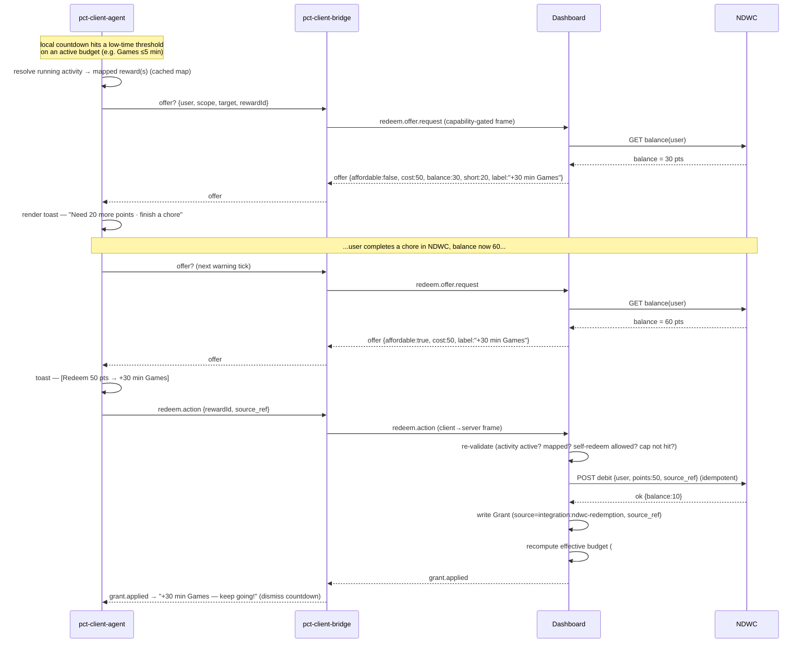

# Roadmap — NDWC reward redemption (user-initiated time extensions)

- **Status:** Draft (2026-06-29). Forward-looking; no feature code has landed.
- **Owner doc:** extends [`roadmap.md`](roadmap.md) Phase 10 ("External
  integrations: family-calendar rewards") and the integration design in
  [`architecture.md`](architecture.md) → "External integrations".
- **Companion docs:** [`client-notifications.md`](client-notifications.md)
  (the agent/bridge channel this extends),
  [`adr/0007-event-stream-version-compatibility.md`](adr/0007-event-stream-version-compatibility.md)
  (the capability-negotiation contract a new interactive frame must obey),
  [`licensing-analysis.md`](licensing-analysis.md) (the boundary an
  *outbound* integration client must respect).

This document plans a second, deeper integration between this toolkit and
[next-digital-wall-calendar](https://github.com/BenSeymourODB/next-digital-wall-calendar)
(**NDWC**). It is a roadmap and a set of design decisions to ratify, not an
implementation.

---

## The feature in one paragraph

A supervised user is told their screen time (or a specific app/activity's
time) is running low. The low-time toast carries a **button**: *"Redeem 50
points for +30 min of Games."* Clicking it spends points the user has
already earned in NDWC and grants the matching screen-time extension —
without a parent in the loop, within rules the parent set in advance. If the
user can't afford the extension, the toast says so and points them at the
chores that would earn the rest. This is the **inverse direction** of the
Phase 10 flow already designed: there, NDWC *pushes* a grant to the dashboard
when a chore is completed; here, the *user* pulls an extension at the moment
of need and the dashboard *spends their points* in NDWC to pay for it.

---

## How this differs from what Phase 10 already plans

Phase 10 (issues #113/#117/#118) is **integrator-initiated, inbound, push**:

```
NDWC backend  ──POST /api/integrations/grants──▶  Dashboard  ──timekpra──▶  client
              (chore completed → +30 min)
```

This feature is **user-initiated, outbound, pull**:

```
client (agent) ──redeem action──▶ Dashboard ──debit points──▶ NDWC
                                  Dashboard ◀──balance/ok──── NDWC
                                  Dashboard ──Grant + timekpra──▶ client
```

Two things are genuinely new and neither exists in the repo today (confirmed
against the issue tracker through #327):

1. **The dashboard must call *out* to NDWC.** Every integration so far is
   inbound-only — NDWC, AdGuard-external, ActivityWatch are all *we read from
   them* or *they call us*. `architecture.md` explicitly parks the reciprocal
   direction: *"The reciprocal direction (dashboard → calendar … is out of
   scope for now but stays open: same pattern, the dashboard would hold a
   per-integration outbound webhook URL."* This roadmap is where that gets
   built — as a read/write client, not just a webhook.
2. **The notification channel must carry a user action back to the server.**
   `client-notifications.md` and the `pct-client-agent` (#103) render
   notifications **one-way**. The agent has local buttons (*"Save & quit
   now"*) but none that call home. We need an interactive button whose handler
   reaches the dashboard.

Everything else **reuses existing machinery** rather than reinventing it.

---

## Build-on / net-new inventory

### Reuse (do not rebuild)

| Existing piece | Issue | How this feature uses it |
|---|---|---|
| `Grant` ledger (immutable, additive, `source`/`source_ref`) | architecture "Policy model" | A redemption **is** a grant: `source = "integration:ndwc-redemption"`, `source_ref =` the redemption id. No new time-accounting primitive. |
| `POST /api/integrations/grants` + idempotency-by-`source_ref` | #113 | The redemption engine writes a grant through the **same** path/semantics; the difference is *who* triggers it and that a point-debit happens first. |
| Grant recompute pipeline (`effective = policy + Σ grants` → push → `grant.applied`) | #117 | Unchanged. A redemption grant recomputes and pushes exactly like a calendar grant. |
| Grant-unlock loop (`grant.applied` on overall → unlock → `lockout.cleared`) | #108 | A redemption against the *overall* budget after a lockout clears it for free. |
| `IntegrationToken` (scoped, revocable, rate-limited) | #113/#115 | The **inbound** half. We add an **outbound** credential record (see R1); the admin manages both on one page. |
| `pct-client-bridge` WS + AF_UNIX dispatch | #101 | The transport for the new interactive frame and the redeem action. |
| `pct-client-agent` notifications/cadence | #103 | Extended with action-button rendering (R4). |
| Capability-gated frames + ADR-0007 handshake | #288/#303 | A redeem-offer / redeem-action frame is a **new capability-gated frame type**, negotiated, never sent to a client that didn't advertise it. The client→server pause-on-lock frame (#316) is the precedent for client→server frames. |
| Activity matcher grammar + `buildActivityQuotas` | ADR 0006, #307 | Resolving "which activity is running" and "which scope a reward maps to" reuse the matcher and the `"scope:targetId"` quota keying. |
| Per-token rate limiting | #115 | Applies to outbound debits too (don't hammer NDWC; bound abuse). |

### Net-new (needs new issues)

| New piece | Milestone | Sketch |
|---|---|---|
| NDWC read/write API (their repo) | R0 | Point-balance read, reward catalog read, **idempotent** point-debit write. |
| Outbound NDWC client in the dashboard | R1 | REST client + per-integration outbound endpoint config; reverse of the inbound path. |
| Reward-mapping model + admin UI | R2 | Bind an NDWC reward → grant `scope`/`target`/`seconds`; surface point cost. |
| Redemption engine (server) | R3 | Affordability check → idempotent debit → `Grant` → recompute/push → `grant.applied`. New user/agent-facing `/api` routes. |
| Interactive notification framework | R4 | Action-button frame (capability-gated), agent button rendering, client→server redeem action over the bridge. |
| Running-activity → reward resolution + affordability UX | R5 | Agent surfaces the *right* offer for the active budget; redeem-vs-"earn more" gating. |
| Redemption controls, audit, edge cases | R6 | Per-user self-redeem policy + caps, redemption ledger view, offline/abuse/failure handling. |

---

## End-to-end sequence



The **authority** at every step is the dashboard, not the agent. The agent's
local offer check is advisory (it makes the button appear instantly without a
round-trip stall); the server re-derives balance, re-checks the activity is
genuinely active and mapped, and re-checks the per-user redemption policy
before it spends a single point. We never trust a client-reported balance,
activity, or cost — consistent with the bridge's "never trusts instructions
from the local user" rule in `client-notifications.md`.

---

## Design decisions to ratify (proposed ADR 0011)

These shape every milestone and should be pinned in an ADR before R1 code
lands, the same way #118 pins the inbound grant contract.

1. **All NDWC traffic is server-side. The agent never holds an NDWC token.**
   The agent talks only to the bridge; the bridge only to the dashboard; the
   dashboard alone holds the NDWC credential and base URL. This preserves the
   single-credential-store model, keeps the child's device free of an
   external secret, and stays NAT-friendly (no inbound to the client).
2. **Domain ownership: NDWC owns the points economy; this toolkit owns
   time.** A *reward's point cost* is a property of NDWC (its currency, its
   inflation, its catalog). Our **reward mapping** binds an NDWC reward id to
   a time grant (`scope`/`target`/`seconds`). The dashboard reads cost from
   NDWC at offer time; it does not store or invent prices. *(Alternative
   considered: cost lives in our mapping. Rejected — it splits the economy
   across two systems and drifts.)*
3. **A redemption reuses the `Grant` ledger; it is not a new entity.**
   `source = "integration:ndwc-redemption"`, `source_ref =` the redemption id.
   It inherits immutability, additivity, `expires_at` (default end-of-day),
   audit, and revoke-as-a-new-row for free.
4. **Idempotency spans both systems via one `source_ref`.** The agent mints
   the `source_ref` for a click; the dashboard uses it as the NDWC debit
   idempotency key **and** the `Grant.source_ref`. The debit is committed
   first; the `Grant` write is the commit point of the whole transaction. A
   retried click (double-tap, reconnect replay) debits once and grants once.
   The hard ordering question — what happens if the debit succeeds but the
   grant write fails, or the timekpra push fails — is the core of the ADR
   (proposal: grant write is durable and authoritative; the push rides the
   existing offline queue #84; a debit with no matching grant is reconciled by
   a compensating credit keyed on the same `source_ref`).
5. **The interactive frame is capability-gated under ADR 0007.** Add a new
   frame type (`redeem.offer`/`redeem.action`) and a capability flag the
   client advertises in its `hello`; the server only sends offers to a client
   that advertised support, and an old client simply never sees a redeem
   button. Bump `eventProtocol`, keep the N-1 window.
6. **Self-redemption is a parent-granted privilege, off by default.** A new
   `RedemptionPolicy` (per user) decides whether the user may self-redeem at
   all, which scopes are eligible, and a daily cap (max points or max minutes
   redeemed per day). This keeps the household framing: the parent sets the
   sandbox once; the child plays inside it.

---

## Milestones

Each milestone is roughly one PR-sized slice and should become one or more
issues on the [roadmap project](https://github.com/users/BenSeymourODB/projects/2),
labelled against Phase 10 (or a new `phase-10b` milestone). Dependencies are
called out so they can be sequenced against the existing build plan.

### R0 — Joint API contract + ADR (coordination gate)

The counterpart to #118, widened to the read/write surface. Nothing else
starts until the wire contract with NDWC is agreed and the design decisions
above are ratified.

- Agree, with the NDWC repo, the three operations the dashboard needs:
  **read balance**, **read reward catalog**, **idempotent debit**.
- Pin the `source_ref` construction, the debit idempotency + reconciliation
  contract, error envelope, and auth model.
- Land **ADR 0011 — outbound integration boundary + redemption transaction
  model** (the decisions above).
- **Depends on:** #118 (reuse its `user_ref` mapping + error conventions).
- **NDWC-side (their repo, tracked there):** expose the three endpoints;
  see "What we need from NDWC" below.

### R1 — Outbound integration client + endpoint config

The reverse-direction plumbing, built once and reusable for the future
outbound webhook (#118 stretch).

- A `transport/ndwc/` REST client (or `integrations/outbound/`) — typed,
  zod-validated responses, timeouts, retries with backoff, per-call audit.
- An **outbound endpoint record** alongside `IntegrationToken`: base URL +
  the credential the dashboard presents to NDWC + scopes. Managed on the
  existing `/admin` integrations page (extends #116-era UI).
- Preflight/health check (like AdGuard-external): can we reach NDWC and
  authenticate?
- **License note:** outbound REST is the same boundary as AdGuard/AW — a
  network call to a separate service, no linkage. Add it to
  `licensing-analysis.md`'s integration table.
- **Depends on:** R0.

### R2 — Reward-mapping model + admin UI

Where an NDWC reward becomes a screen-time grant.

- `RewardMapping (id, ndwc_reward_ref, scope=overall|activity|group,
  target_id?, seconds_granted, enabled, ...)` — binds a catalog reward to a
  grant shape. Reuses the `scope`/`target_id` vocabulary of `Budget`/`Grant`
  and the `"scope:targetId"` keying from `buildActivityQuotas` (#307).
- Admin UI: list NDWC's catalog (read via R1), map each reward to a scope +
  target + seconds, enable/disable. Cost is shown read-only from NDWC.
- Validation that `target_id` resolves to a real `Activity`/`ActivityGroup`.
- **Depends on:** R1 (to read the catalog), #307 (quota keying).

### R3 — Redemption engine (server)

The transaction core. Headless — drivable from `/api` before any client UI.

- `POST /api/redemptions` (and an offer/quote route, e.g.
  `GET /api/redemptions/offer?...`) — the user/agent-facing surface, guarded
  by the per-client bearer token (not an `IntegrationToken`; the request
  originates on a managed client, not from NDWC).
- Engine: re-validate (mapping enabled? activity active? self-redeem allowed
  per R6 policy? cap not hit?) → read balance → if affordable, idempotent
  debit → write `Grant` → hand off to the #117 recompute/push pipeline → it
  emits `grant.applied`.
- Affordability/quote response: `{affordable, cost, balance, shortfall,
  label, expires_at}`.
- Reconciliation job for debit-succeeded/grant-failed (compensating credit).
- **Depends on:** R1, R2, #113/#117 (grant write + recompute), #108 (unlock
  for the overall-budget case).

### R4 — Interactive notification framework

Make the button real and make the click reach R3.

- New capability-gated frame types under ADR 0007: `redeem.offer` (server→
  client, carries the quote) and `redeem.action` (client→server, carries the
  click + `source_ref`). Bump `eventProtocol`; advertise the capability in
  the bridge `hello` (#303/#288); model the client→server direction on the
  pause-on-lock frame (#316).
- `pct-client-agent`: render action buttons via `gdbus`
  `org.freedesktop.Notifications` actions (it already uses `gdbus` for the
  in-place countdown), with a `notify-send --action` fallback; wire the
  button's invoked-action signal to send `redeem.action` over the AF_UNIX
  socket to the bridge.
- Bridge: forward `redeem.action` to the dashboard and route the resulting
  `grant.applied` back to the agent (existing path).
- **Depends on:** R3, #101/#103, #288/#303, ADR 0007.

### R5 — Running-activity resolution + affordability UX

Surface the *right* offer at the *right* moment.

- Agent resolves the foreground/active budget (it already polls `aw-server`
  for usage and holds the cached budget) to its mapped reward(s) using the
  cached reward-mapping + activity matcher. Push the enabled mappings to the
  client with policy.
- On a low-time warning tick for a budget that has a mapping, the agent
  requests a quote (R3/R4) and renders:
  - **affordable** → an actionable redeem button (label + cost);
  - **not affordable** → a non-actionable, non-punitive nudge ("Need 20 more
    points — finish a chore to earn them"), matching the `child-status` /
    `My Time` (#61) "earn more" tone. Never "blocked/denied".
- Coalesce with the existing multi-budget warning coalescing so a redeem
  offer doesn't spam.
- **Depends on:** R4, ADR 0006, the #103 cadence.

### R6 — Redemption controls, audit & edge cases

Make it safe for a non-technical household (Alpha-2 bar).

- `RedemptionPolicy` per user: self-redeem on/off, eligible scopes, daily
  cap (points and/or minutes), pushed to the client with the rest of policy
  (cap is *also* enforced server-side in R3 — the client copy is for UX only).
- Redemption history in the `/admin` grant ledger (#116): filter
  `source = integration:ndwc-redemption`, show points spent + balance after,
  revocable like any grant.
- Edge cases: bridge offline at click time (no offer shown — fail closed, the
  user keeps cached limits; do not let an offline click promise time);
  NDWC unreachable (offer not shown / quote errors gracefully); double-tap
  and reconnect replay (idempotent by `source_ref`); reward disabled or
  re-priced between offer and click (server re-validates and may decline with
  a fresh quote); cap exhausted (decline with "you've redeemed your max for
  today").
- Per-token + per-user rate limiting (#115) on offers and debits.
- **Depends on:** R3–R5.

---

## What we need from NDWC (their repo)

Tracked in next-digital-wall-calendar; listed here so the contract is
visible from this side. NDWC needs a small, authenticated machine API the
dashboard can call with a per-integration credential:

| Operation | Shape (illustrative, finalised in R0) | Notes |
|---|---|---|
| Read balance | `GET /api/points/balance?user_ref=alice` → `{ points }` | Same `user_ref` mapping as #118's inbound grants. |
| Read reward catalog | `GET /api/rewards` → `[{ reward_ref, label, cost_points }]` | Source of truth for cost; the dashboard maps each `reward_ref` to a time grant. |
| Debit points | `POST /api/points/debit` `{ user_ref, points, source_ref, reason }` → `{ balance }` | **Idempotent by `source_ref`.** A repeat with the same `source_ref` returns the same result, never double-debits. |
| (Optional) Compensating credit | `POST /api/points/credit` `{ user_ref, points, source_ref }` | For R3 reconciliation when a debit committed but the grant didn't. |

NDWC's own ownership of points means the toolkit never mints, prices, or
stores point balances — it reads and spends them.

---

## Sequencing against the existing roadmap

This work is **not** a blocker for Alpha-1 or Alpha-1.5 and sits naturally
after the Phase 10 grant core and the Phase 8b agent are in place:

- **Hard prerequisites:** Phase 10 grant pipeline (#113/#117) and Phase 8b
  agent + bridge + ADR-0007 handshake (#101/#103/#303/#288). The grant-unlock
  loop (#108) is needed only for the overall-budget-after-lockout path.
- **Natural slot:** alongside or just after Phase 10 / Phase 12 ("My Time"
  #61, whose Rewards tab is the read-only complement to this interactive
  flow), well after the Alpha-2 gate (which already requires Phase 8b).
- R0 (contract + ADR) can begin **now**, in parallel with Phase 10, because
  it's coordination, not code — exactly like #118 started before #113.

## License & tamper-resistance notes

- **License boundary unchanged.** The outbound NDWC client is a REST call to
  a separate service over the network — the same boundary class as AdGuard
  and ActivityWatch (`licensing-analysis.md`). No linkage, no vendoring, no
  new GPL surface.
- **Tamper-resistance ceiling unchanged.** This is a feature *for* the
  supervised user (spend earned points for time), not a hardening surface.
  The only trust rule it adds is the standard one: the server is
  authoritative and re-validates every redeem request; it never trusts a
  client-reported balance, activity, cost, or cap. That is ordinary
  client/server hygiene, not an arms race — consistent with CLAUDE.md's
  "Tamper resistance is deliberately bounded".

## Out of scope (for this roadmap)

- Letting NDWC drive screen-time **schedules/rules** (allow/deny windows) —
  that is the separate stretch #125, explicitly *not* the additive-grant
  primitive this feature uses.
- Earning points (chores, calendar events) — that is NDWC's domain; this
  toolkit only spends them.
- Parent-phone push tying into redemption — the parent-side low-time push and
  quick-grant (#65/#111) stays the parent's lever; this feature is the
  child's.
