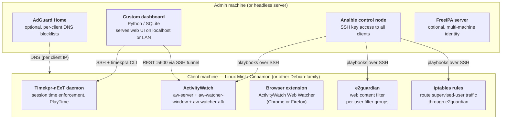

# Proposed tech stack

**Project:** Linux screen-time administration server/client application  
**Primary client target:** Linux Mint with Cinnamon (Ubuntu/Debian-family); other distros to be supported where tools permit  
**Server target:** Admin's desktop or headless Linux server

---

## Architecture summary

The solution is composed of four layers: an **admin web dashboard** (custom-built) that orchestrates a **transport/config layer** which reads from and writes to **per-client agents**, which in turn drive **enforcement backends**. No single existing tool covers more than one of these layers completely, so the strategy is to integrate purpose-built tools at each layer and write only what cannot be assembled from existing components.

---

## Layer 1 — Admin web dashboard (custom)

The only fully custom layer. Responsibilities:

- Stores the canonical policy model: per-user time budgets, per-activity and per-activity-group quotas, schedules, exceptions, and user-to-device mappings
- Provides the web UI through which the admin sets and views all of the above
- Aggregates usage telemetry pulled from client-side ActivityWatch instances into per-user, per-activity usage views
- Queues policy changes for clients that are offline and replays them on reconnect
- Exposes a local HTTP API consumed by the transport layer

**Technology choices for the dashboard itself** are left open at this stage, but the architecture favours a lightweight Python web framework (FastAPI or Flask) backed by SQLite for policy state, which is consistent with the Python tooling used across the rest of the stack. A React or plain HTML/JS frontend served by the same process is sufficient; no separate frontend build pipeline is required for the admin-only use case.

> **Refinement (post-original-draft):** The "admin web dashboard" layer
> evolves to expose **two frontends behind one FastAPI process**:
>
> - **`/admin/*`** — server-rendered Jinja2 + HTMX with small Svelte
>   "islands" for high-interactivity bits (live burndown charts, schedule
>   editors). Desktop admin experience.
> - **`/app/*`** — a SvelteKit static build (PWA-capable) for the
>   mobile-first user-facing experience: per-child status screens,
>   parents adjusting limits from a phone, home-screen install with a
>   service worker for live updates.
> - **`/api/*`** — JSON API consumed by both frontends *and* by external
>   integrations (e.g. a family-calendar reward system that grants
>   screen time on chore completion — see "External integrations" in
>   `docs/architecture.md`).
>
> Both frontends are produced at image-build time; the runtime image
> stays Python-only. The CI pipeline gains a Node build step but the
> Docker image does not gain a Node runtime.

---

## Layer 2 — Transport and orchestration

This layer is responsible for translating policy decisions made in the dashboard into configuration changes on client machines, and for pulling telemetry back to the server.

### Primary transport: SSH + `timekpra` CLI

Direct invocation of `timekpra` over SSH is the pattern already validated by both `timekpr-next-remote` and `timekpr-webui`. It requires only that the server have SSH key access to a dedicated low-privilege user on each client, and that Timekpr-nExT be installed on the client. No persistent agent is needed on the client for this transport.

### Config push: Ansible

Ansible (agentless, GPLv3) is the right tool for deploying and maintaining the full client-side configuration: installing packages, writing e2guardian filter group configs, managing iptables rules, and deploying the ActivityWatch systemd service. It is invoked by the dashboard when policy changes require file-level changes on clients rather than just `timekpra` parameter updates.

Ansible's push model also serves as a tamper-reversion mechanism: periodic playbook runs re-assert the desired configuration state, reversing any manual edits made on the client.

### Reference implementations to study (not to depend on)

- **timekpr-webui** (adambie) — demonstrates offline-queue pattern and SSH-based multi-client orchestration
- **timekpr-next-remote** (mrjones-plip) — demonstrates Gotify alert integration and SSH+`timekpra` wiring

---

## Layer 3 — Client-side agents

Three agents run on each enrolled client. All are installed and maintained via the Ansible layer.

### 3a. Session time control — Timekpr-nExT

**Role:** Enforces overall daily/weekly/monthly screen-time budgets at the session level. Kills the user session (configurable: logout, suspend, lock, or shutdown) when the budget is exhausted.

**Integration surface:** D-Bus (local) and `timekpra` CLI (remote over SSH). The dashboard writes session-limit policy by calling `timekpra` subcommands remotely.

**PlayTime feature:** Groups of processes can be assigned a separate sub-budget within the overall session budget. This is the primary mechanism for per-application time quotas. Its limitation (no independent per-app budget, only grouped budgets) means more granular per-app enforcement requires additional logic in the dashboard or a complementary process-kill script.

### 3b. Activity tracking — ActivityWatch

**Role:** Records which application is in the foreground and which website is active in the browser, with second-level resolution. This data is the basis for the dashboard's usage reporting views and for triggering per-activity quota enforcement.

**Watchers deployed per client:**
- `aw-watcher-window` — tracks active application and window title
- `aw-watcher-afk` — detects idle time; only active (non-AFK) periods count toward quotas
- Browser extension (Chrome or Firefox) — provides per-URL/domain data rather than just "Firefox is open"

**Integration surface:** ActivityWatch exposes a local REST API on port 5600. The dashboard pulls data from each client via SSH port-forwarding (not by exposing the port on the network, since ActivityWatch has no authentication). A lightweight polling agent or systemd timer on each client can forward daily summaries to the dashboard server.

**Important limitation:** ActivityWatch is intentionally designed for self-monitoring, not supervised monitoring. The project's documentation actively discourages remote use. The integration approach (SSH tunnel, read-only pull, data aggregated on the server rather than stored centrally) respects both the technical constraints and the design intent while achieving the goal.

### 3c. Web filtering proxy — e2guardian

**Role:** Enforces per-user website access rules and, in combination with dashboard-generated block schedules, time-limited website access (e.g., "social media only between 15:00 and 17:00").

**Deployment model:** One e2guardian instance per client, configured with per-user filter groups keyed to Linux UIDs. Traffic is routed through it via iptables `OUTPUT` chain rules that redirect port 80/443 traffic from the supervised user's UID to the local proxy port. This preserves per-user identity (transparent proxying would lose it).

**Upstream proxy:** e2guardian v5+ runs standalone without requiring a separate proxy for basic deployments. Squid should be added if caching, NTLM authentication, or HTTPS MITM inspection is required.

**DNS layer (server-side, optional):** AdGuard Home running on the admin server provides a complementary network-level DNS blocklist enforcement layer. It operates per client-IP rather than per Linux user, making it useful for coarse-grained domain blocking (adult content categories, known malware domains) but insufficient on its own for per-user or time-limited policies.

> **Refinement (post-original-draft):** Recognising that the target user
> (parents already running a homelab / home server) often *already*
> runs AdGuard Home, the dashboard supports three modes for the DNS
> layer:
>
> - **`disabled`** — no DNS integration (default).
> - **`managed`** — the dashboard fetches AdGuard Home on first run,
>   supervises it as a sidecar, and owns its configuration.
> - **`external`** — the dashboard makes REST calls against an existing
>   AdGuard Home instance the admin already runs, confining itself to
>   a dedicated AdGuard user account and a `pct:`-prefixed set of
>   AdGuard "clients" so it does not touch unrelated configuration.
>
> Integration is REST-API-only in every mode, so the license posture
> is identical to the sidecar approach.

---

## Layer 4 — Enforcement backends

These are the system-level mechanisms that the agent layer configures and that actually enforce policy. They are not "tools" in the sense of running additional software; they are existing OS facilities.

### Session enforcement

- **systemd-logind** — Timekpr-nExT's primary enforcement target; kills sessions via logind's inhibitor and session-termination APIs
- **PAM time restrictions** (fallback) — can enforce allowed-hours windows at login time without Timekpr-nExT, but less flexible

### Application access control

- **Timekpr-nExT PlayTime** — per-process-group sub-budget within the overall session limit
- **AppArmor profiles** — can deny execution of specific binaries for specific users; complements PlayTime for outright-deny use cases rather than time-limited access
- **malcontent / AccountsService** — useful only for Flatpak applications; does not apply to native packages on Cinnamon/Mint and is not relied upon in this stack

### Network enforcement

- **iptables / nftables** — routes per-user web traffic through e2guardian; also enforces time-window internet blocks generated by the dashboard via scheduled rule insertion/removal (managed by Ansible + cron or a systemd timer)
- **AdGuard Home REST API** — the dashboard can dynamically update per-client blocklists via the AdGuard Home API, enabling timed domain restrictions at the DNS level

### Identity and access (optional, for multi-machine deployments)

- **FreeIPA** — if the deployment involves multiple machines sharing user identities, FreeIPA provides centralized user accounts, Kerberos SSO, HBAC rules (which host each user can log into), and centralized sudo policy. It does not provide screen-time budgets or per-app quotas, but it eliminates the need for the dashboard to manage user accounts directly. Time-of-day HBAC login restrictions remain unshipped in FreeIPA as of 2025 and cannot be relied upon.

---

## Tools evaluated and not adopted

| Tool | Reason not adopted |
|---|---|
| **LittleBrother** | Multi-host client/server architecture is useful reference, but the project appears unmaintained (last release 2022); screen-time logic would duplicate Timekpr-nExT |
| **timekpr-webui / timekpr-next-remote** | Reference implementations only; both are too limited in scope to serve as the dashboard itself |
| **UCS (Univention Corporate Server)** | Compelling GPO-style control surface, but Univention Corporate Client (the Linux desktop component) is stale; no screen-time concept |
| **SaltStack** | Viable alternative to Ansible for the config-push layer; stronger event-driven/tamper-detection story via Beacons+Reactor, but adds operational complexity. Worth revisiting if tamper resistance becomes a priority requirement |
| **Puppet / Chef** | Viable for config enforcement, but heavier than needed for this use case; Ansible's agentless model is preferable at small-to-medium client counts |
| **Pi-hole** | DNS filtering only; no per-user rules, no time-quotas, no Safe Search enforcement. AdGuard Home is strictly superior for this use case |
| **FleetDM** | Useful for device inventory and software audit at scale; no parental-controls concept and adds significant operational overhead for the target deployment size |
| **malcontent** | Flatpak-only enforcement; does not apply to native packages on Cinnamon |

---

## Deployment topology

Client machines are enrolled by running an Ansible playbook that installs and configures all of the above. Policy updates flow server→client via SSH+`timekpra` (session limits) and Ansible (file-level config changes). Telemetry flows client→server via SSH port-forwarding to the ActivityWatch REST API.
