# Dashboard screenshots

Live captures of the admin dashboard (and the PWA shell) running from the
local-development image (`docker compose up --build`). They are generated by
driving headless Chromium against a running instance seeded with illustrative
data — supervised users **Alice / Bob / Chloe** and three `mint-*` clients —
so the tables and cards show real, rendered rows rather than empty states.

> **These reflect what is actually built today**, not the full design vision.
> The static design studies in [`../../design/`](../../design/) explore the
> intended UX (per-user policy editor, burndown rings, grants ledger, the PWA
> child/parent screens, the client desktop app); the
> [roadmap](../roadmap.md) tracks the gap. See
> ["Implemented vs. designed"](#implemented-vs-designed) below.

The admin experience is one prerendered page that switches between views with
client-side state (see the note in `server/frontend/src/routes/admin/+page.svelte`).

## Admin surface

### Sign in
Single-admin login (Argon2id, signed session cookie).

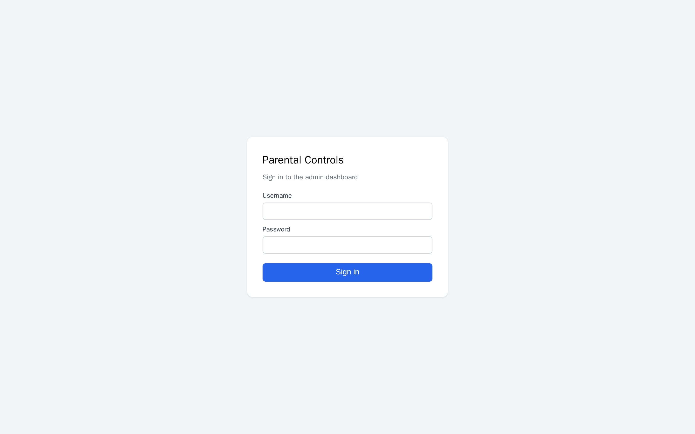

### Dashboard
The landing view — currently a static welcome panel; KPI tiles, live burndown
rings, and the activity feed from the dashboard mock-up are not built yet.

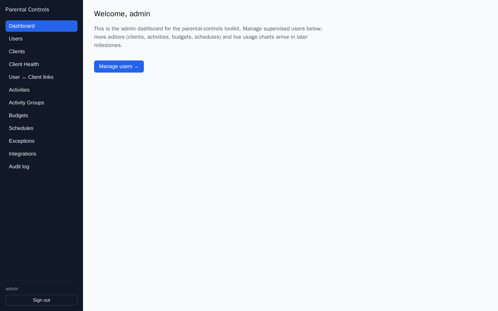

### Users
Supervised user accounts (display name + effective timezone) that time and
content limits attach to.

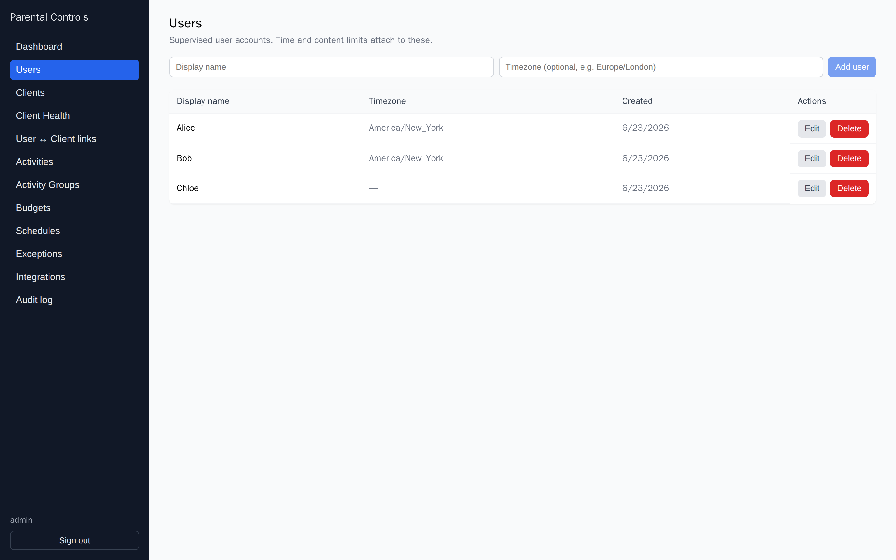

### Clients
Basic CRUD for the enrolled Linux desktops (hostname + SSH user).

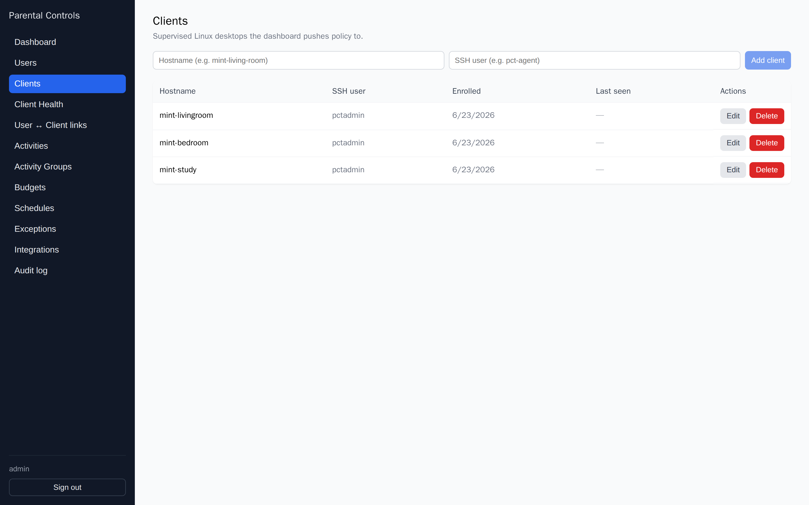

### Client Health
The richest view: per-machine reachability and five-component health
(Timekpr-nExT, ActivityWatch, e2guardian, `pct-client-bridge`,
`pct-client-agent`), plus queued-change state for offline clients. Components
read `unknown` until the server-side SSH prober is wired.

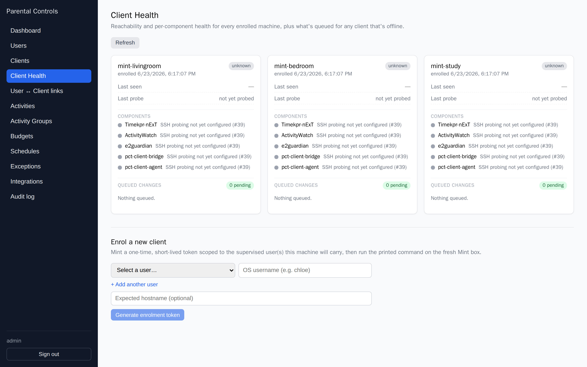

### Enrol a client
Minting a single-use enrolment token produces the `curl … | sudo bash` install
one-liner to run on a fresh Mint box.

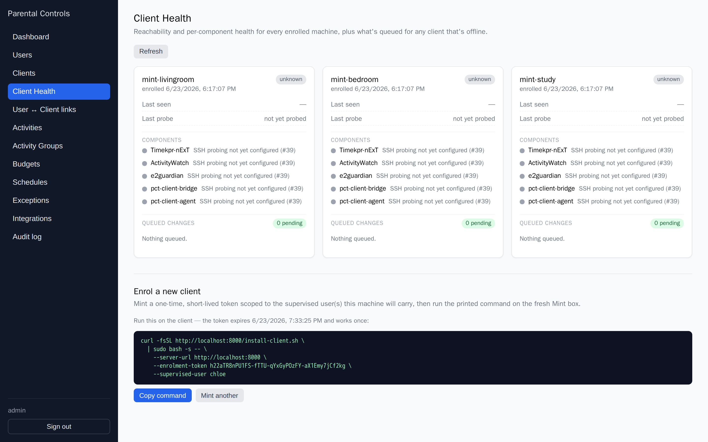

### User ↔ Client links
Maps a policy user to an OS account (`osUsername` + UID) on a client, with a
one-off "Add time today" lever (a transient adjustment, **not** a logged grant).

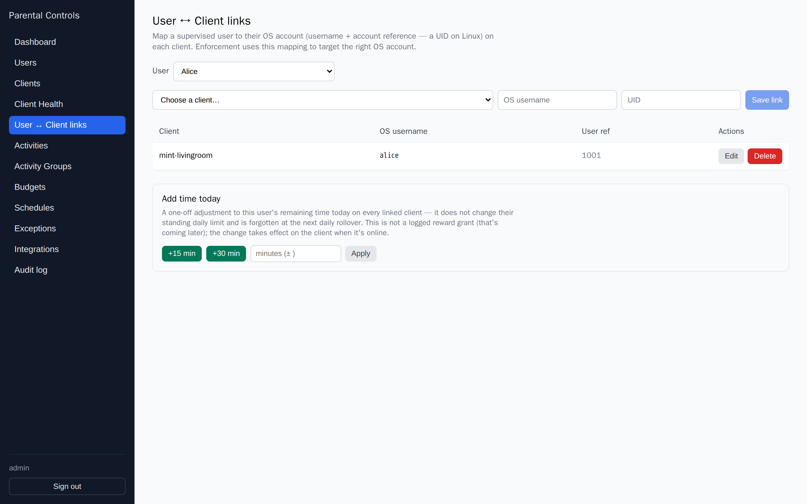

### Activities
The matcher CRUD: app/domain matchers with exact/substring/glob/regex match
types that budgets and schedules target.

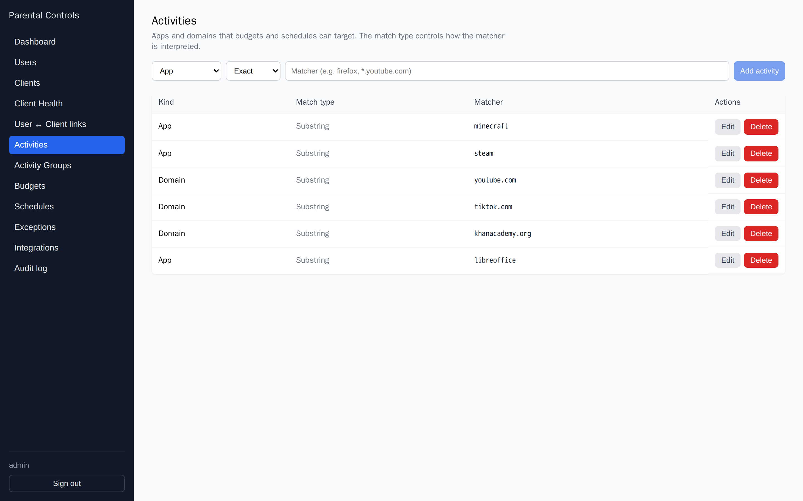

### Activity Groups
Named bundles of activities (e.g. *Games* → minecraft, steam) so one limit can
cover a whole set; expand a group to manage its members.

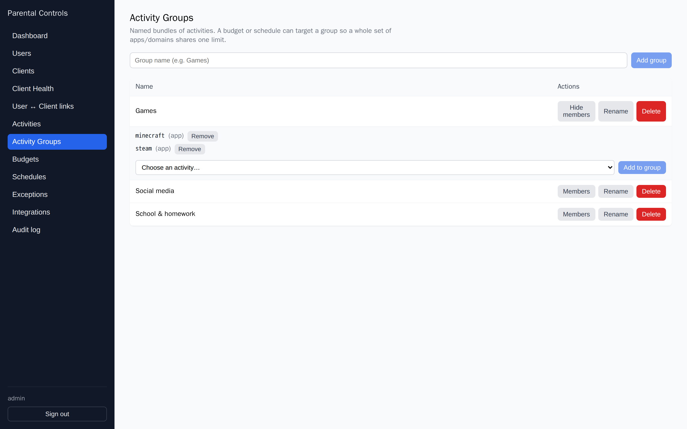

### Budgets
Time allowances per user, per rollover window (daily / weekly / monthly),
scoped to overall time, a single activity, or a group.

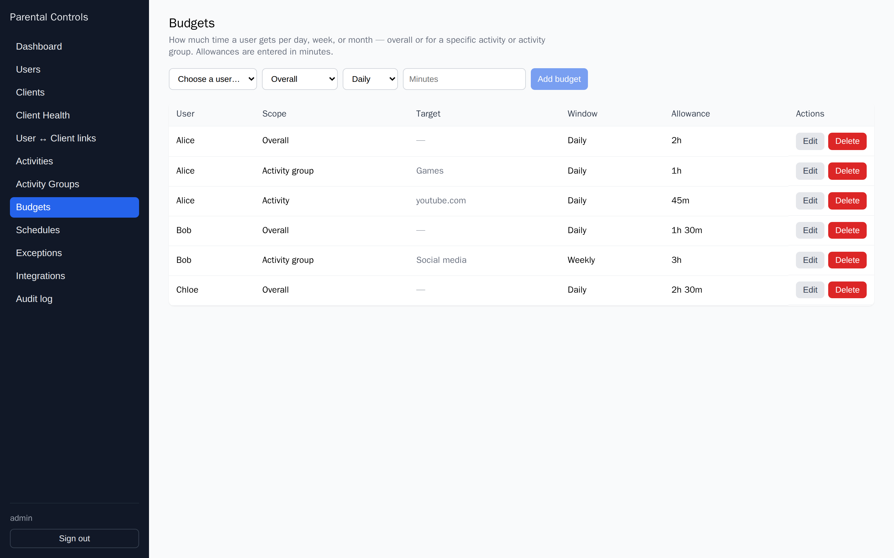

### Schedules
Recurring allow/deny/extend rules. Day-of-week and time-of-day windows
(shown as "Always" here) and drag-to-reorder are still to come.

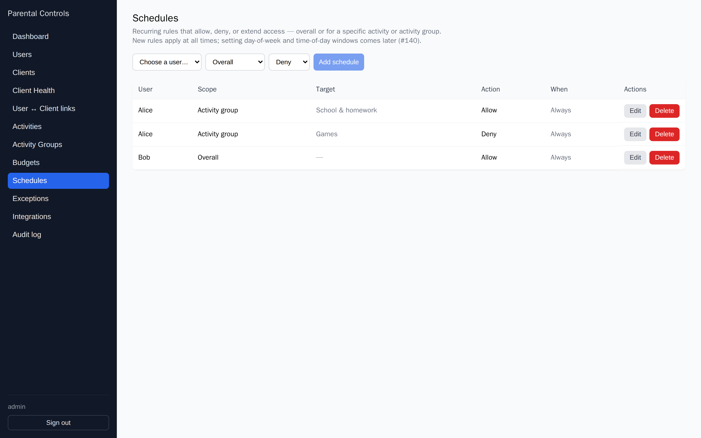

### Exceptions
One-off, date-boxed overrides — e.g. *"Finished chores → bonus weekend time"* —
with an expiry and optional reason.

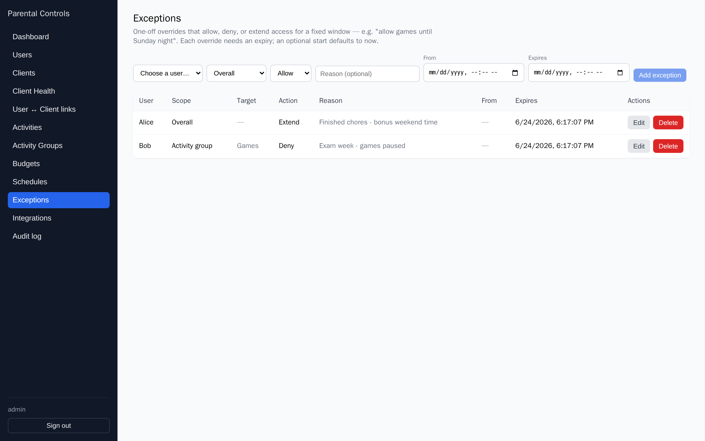

### Integrations
Scoped, revocable API tokens for external systems (e.g. the family calendar).
The AdGuard mode selector and notification defaults from the mock-up are not
built yet.

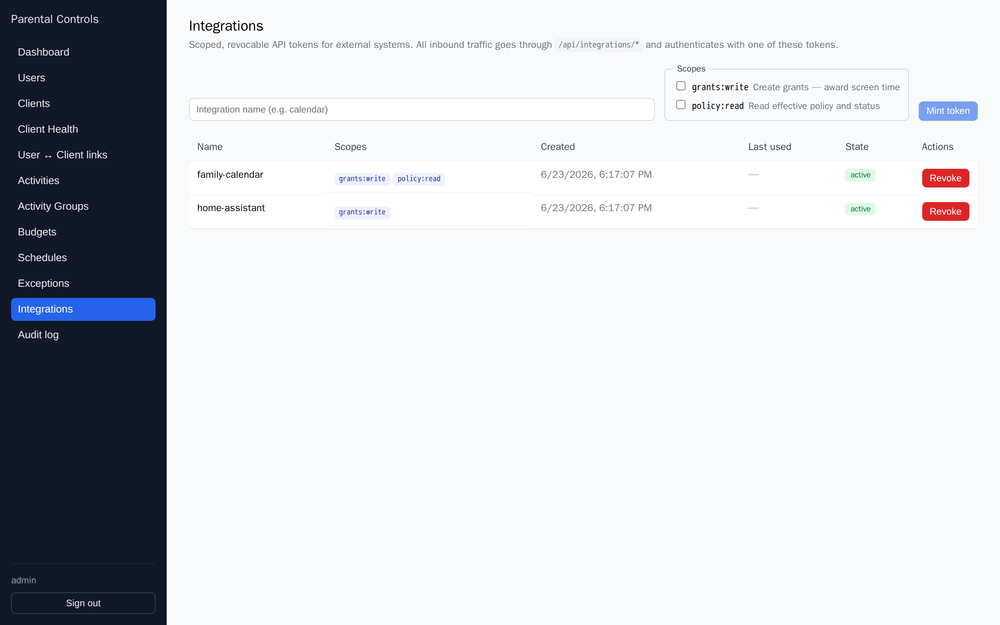

### Audit log
Newest-first record of every command issued to a client, filterable by client
and outcome. (No mock-up; added during implementation.)

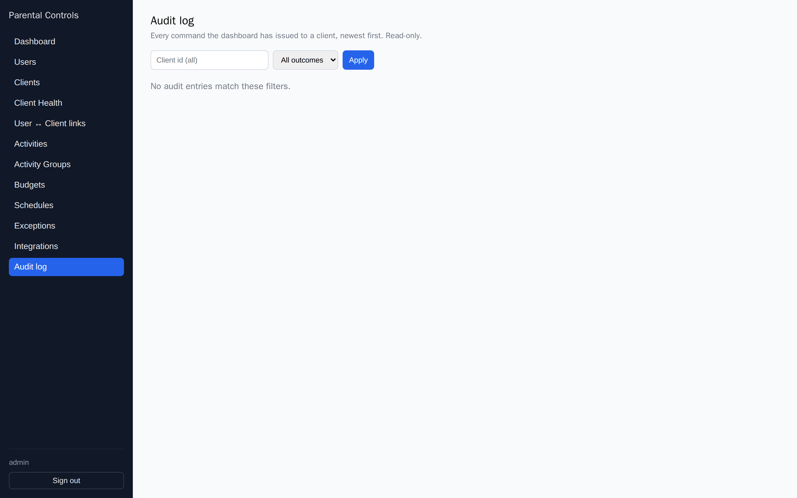

## App (PWA) surface

### My Time (shell)
The installable mobile/PWA surface currently ships only the app shell — header,
offline banner, and bottom tab bar. The live child-status, parent-home, and
quick-grant screens land in later phases.

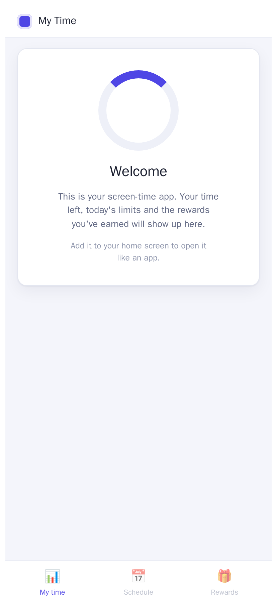

## Implemented vs. designed

| Design mock-up | Status today |
|---|---|
| `admin/dashboard.html` (KPIs, burndown rings, feed) | Not built — static welcome |
| `admin/user-detail.html` (burndown chart, AW timeline) | Not built (chart components exist but are unmounted) |
| `admin/policy-editor.html` (one editor) | Split into Budgets / Activities / Groups / Schedules / Exceptions; no drag-order, day/time windows, or save-&-push diff |
| `admin/grants-ledger.html` | Not built |
| `admin/clients.html` | Covered by Clients + Client Health |
| `admin/integrations.html` | Tokens only; no AdGuard mode, no notification defaults |
| `app/parent-home`, `app/grant`, `app/child-status` | Shell only |
| `client/dashboard`, `client/notifications` | Not built in this repo |

## Regenerating

Bring the dashboard up (`docker compose up --build`), create an admin and some
sample data via `/api`, then drive a browser against `http://localhost:8000`.
The captures here were taken at 1440×900 (2× DPI) for the admin views and
414×896 for the PWA.
